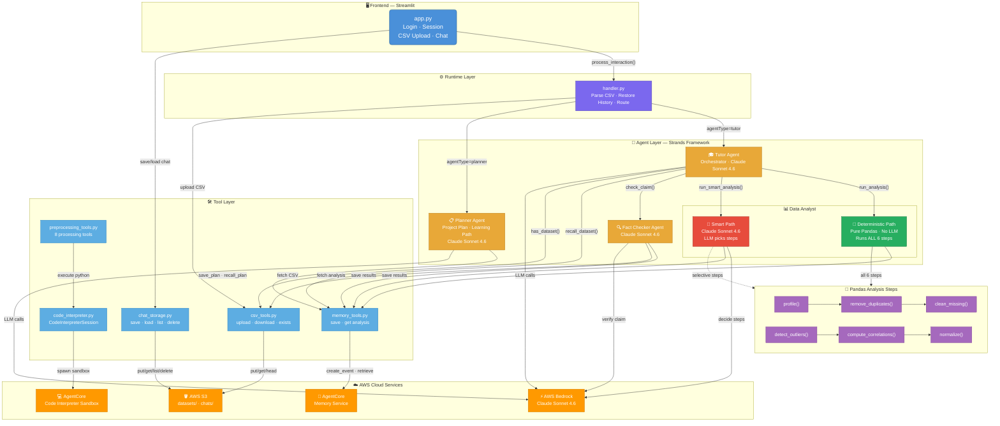

# 📊 Strands Agent — AI-Powered Data Tutoring & Planning System

An intelligent tutoring system that teaches students data analysis through Socratic dialogue **and** helps them plan data analysis projects with personalized learning paths. Powered by AWS Bedrock (Claude Sonnet 4.6), the multi-agent system guides students to discover insights from their own datasets rather than simply giving answers.

---

## 🧠 How It Works

Students can switch between two agents via a dropdown in the UI:

**📊 Tutor Agent** — Upload a CSV file and chat with an AI tutor that:
- Analyzes their dataset automatically (deterministic or LLM-powered)
- Asks Socratic questions to guide their thinking
- Fact-checks claims students make about their data
- Remembers previous sessions so learning can continue across logins
- Persists chat history so students can revisit past conversations

**📋 Planner Agent** — Get help planning a data analysis project:
- Interviews the student about their project, skills, timeline, and goals
- Creates a week-by-week project plan with milestones
- Generates a personalized learning path for missing skills
- Saves and recalls plans across sessions via AgentCore Memory

---

## 🏗️ Architecture Overview

The system is composed of four layers:

### 1. Frontend (Streamlit)
- `app.py` — handles login/session management, CSV upload, chat interface, and chat history sidebar (load/delete past conversations)

### 2. Runtime Layer
- `runtime/handler.py` — parses incoming CSV (raw, base64, or multipart), restores conversation history, and routes requests to the appropriate agent (Tutor or Planner) based on the `agentType` field

### 3. Agent Layer (Strands Framework)
| Agent | Role | Model |
|---|---|---|
| **Tutor Agent** | Orchestrator — drives Socratic dialogue | Claude Sonnet 4.6 |
| **Data Analyst** (Deterministic path) | Runs ALL 6 Pandas analysis steps — no LLM | — |
| **Data Analyst** (Smart path) | LLM decides which analysis steps are relevant | Claude Sonnet 4.6 |
| **Fact Checker Agent** | Verifies student claims against actual data | Claude Sonnet 4.6 |
| **Planner Agent** | Interviews student & creates project plan + learning path | Claude Sonnet 4.6 |

### 4. Tool Layer
| Tool | Responsibility |
|---|---|
| `csv_tools.py` | Upload / download / check existence of CSV in S3 |
| `chat_storage.py` | Save, load, list, and delete chat history in S3 |
| `memory_tools.py` | Save and retrieve dataset analysis summaries and project plans via AgentCore Memory |
| `code_interpreter.py` | Spawn sandboxed Python execution sessions via AgentCore |
| `preprocessing_tools.py` | 8 data processing utilities (clean, profile, normalize, encode, etc.) |

---

## ☁️ AWS Services

| Service | Usage |
|---|---|
| **AWS Bedrock** | LLM inference using `us.anthropic.claude-sonnet-4-6` |
| **AWS S3** | Stores raw CSV files at `datasets/{user_id}/dataset.csv` and chat history at `chats/{username}/{chat_id}.json` (CSV max 10 MB) |
| **AWS AgentCore Memory** | Persists dataset analysis summaries and project plans per user (namespace: `{username}`) |
| **AWS AgentCore Code Interpreter** | Sandboxed environment for executing Pandas/NumPy/SciPy code |

---

## � Installation

1. Clone the repository:
   ```bash
   git clone <repository-url>
   cd Multi-Agent
   ```

2. Navigate to the project directory and install dependencies:
   ```bash
   cd strandsagent
   pip install -r requirements.txt
   ```

## ⚙️ Setup

1. Create a `.env` file in the `strandsagent/` directory with your AWS credentials and configuration:
   ```
   AWS_ACCESS_KEY_ID=your_access_key_id
   AWS_SECRET_ACCESS_KEY=your_secret_access_key
   AWS_DEFAULT_REGION=us-east-1
   ```

2. Ensure you have access to AWS Bedrock with the `us.anthropic.claude-sonnet-4-6` model, and the necessary permissions for S3 and AgentCore services.

## ▶️ Running the Application

From the `strandsagent/` directory, run:
```bash
streamlit run app.py
```

Open the provided local URL in your browser to access the application.

---

## �🗺️ System Architecture Diagram



---

## 🔄 Key Flows

### CSV Upload & Analysis
1. Student uploads CSV via Streamlit
2. Handler uploads file to S3 (`datasets/{user_id}/dataset.csv`)
3. Tutor Agent triggers Data Analyst (deterministic path by default)
4. Data Analyst runs all 6 Pandas steps locally: profile, remove duplicates, clean missing, detect outliers, compute correlations, suggest normalization
5. Analysis summary is saved to AgentCore Memory
6. Tutor generates a Socratic opening question (does **not** share raw results)

### Smart Analysis (Alternative Path)
1. Tutor triggers `run_smart_analysis()` for targeted analysis
2. A dedicated Strands Agent (Claude Sonnet 4.6) examines the dataset profile
3. The LLM selectively calls only the relevant Pandas steps (e.g., skips correlations if only 1 numeric column)
4. Results are saved to AgentCore Memory

### Fact Checking
1. Student makes a claim (e.g. *"The average age is 35"*)
2. Tutor delegates to Fact Checker Agent
3. Fact Checker retrieves stored analysis from AgentCore Memory + raw CSV from S3
4. Claude verifies the claim and returns `CORRECT` / `WRONG` / `AMBIGUOUS` with reasoning
5. Tutor wraps the verdict in a Socratic follow-up response

### Returning User Session Restore
1. Student logs in without uploading a new CSV
2. Tutor checks S3 for an existing dataset via `has_dataset()`
3. Tutor retrieves previous analysis from AgentCore Memory via `recall_dataset()`
4. Dialogue resumes from where it left off

### Project Planning & Learning Path
1. Student switches to the Planner Agent via the dropdown
2. Planner interviews the student about their project topic, experience level, timeline, and goals
3. Planner creates a week-by-week project plan with milestones and a personalized learning path for missing skills
4. Plan is saved to AgentCore Memory via `save_plan()`
5. When the student returns, the handler detects the existing plan and the agent offers to continue or start fresh

### Chat History Persistence
1. Each conversation is auto-saved to S3 at `chats/{username}/{chat_id}.json`
2. Students can load or delete past chats from the sidebar

---

## 📁 Project Structure

```
strandsagent/
├── app.py                          # Streamlit frontend
├── requirements.txt                # Python dependencies
├── .env.example                    # Environment variable template
├── runtime/
│   ├── __init__.py
│   └── handler.py                  # Runtime routing layer
├── agents/
│   ├── __init__.py
│   ├── tutor_agent.py              # Tutor Agent (orchestrator)
│   ├── planner_agent.py            # Planner Agent (project plan + learning path)
│   ├── data_analyst_agent.py       # Data Analyst (deterministic + smart paths)
│   └── fact_checker_agent.py       # Fact Checker Agent
└── tools/
    ├── __init__.py
    ├── csv_tools.py                # S3 CSV operations
    ├── chat_storage.py             # S3 chat history persistence
    ├── memory_tools.py             # AgentCore Memory operations
    ├── code_interpreter.py         # AgentCore Code Interpreter
    └── preprocessing_tools.py      # 8 data processing tools
```

---

## ⚙️ Prerequisites

- Python 3.10+
- AWS account with access to:
  - AWS Bedrock (Claude Sonnet 4.6)
  - AWS S3
  - AWS AgentCore (Memory + Code Interpreter)
- Strands Agent framework installed

---

## 🚀 Getting Started

### 1. Clone the repository
```bash
git clone https://github.com/supakitboon/Multi-Agent.git
cd Multi-Agent
```

### 2. Install dependencies
```bash
pip install -r strandsagent/requirements.txt
```

### 3. Configure environment variables
```bash
cp strandsagent/.env.example strandsagent/.env
```

Edit `strandsagent/.env` with your AWS credentials and config:
```env
AWS_REGION=us-east-2
AWS_ACCESS_KEY_ID=your_access_key
AWS_SECRET_ACCESS_KEY=your_secret_key
AWS_SESSION_TOKEN=your_session_token
S3_BUCKET_NAME=your_bucket_name
AGENTCORE_MEMORY_ID=your_memory_id
```

### 4. Run the app
```bash
cd strandsagent
streamlit run app.py
```

---

## 🔐 Security Notes

- Each user's data is isolated in S3 under `datasets/{user_id}/` and `chats/{username}/`, and in AgentCore Memory under their own namespace
- CSV files are capped at **10 MB**
- Code execution runs in an **isolated AgentCore sandbox** — no access to the host environment
