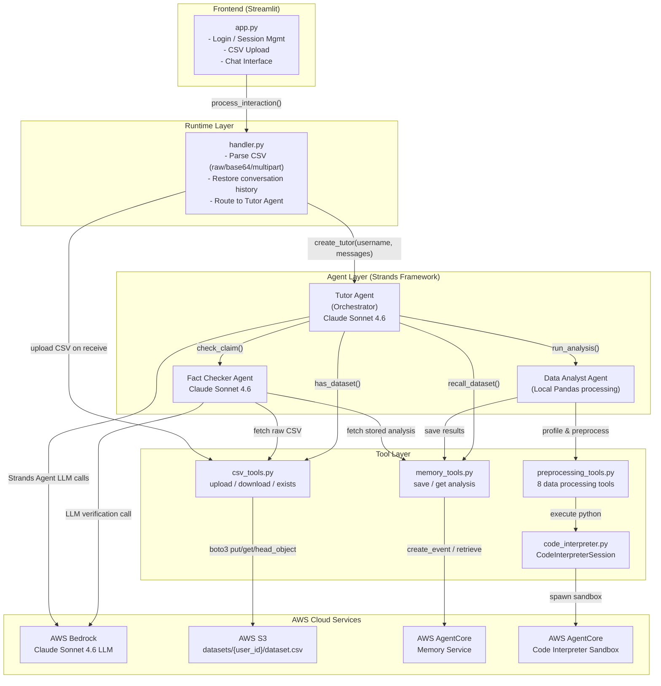

# 📊 Strands Agent — AI-Powered Data Tutoring System

An intelligent tutoring system that teaches students data analysis through Socratic dialogue. Powered by AWS Bedrock (Claude Sonnet 4.6), the agent guides students to discover insights from their own datasets rather than simply giving answers.

---

## 🧠 How It Works

Students upload a CSV file and chat with a Tutor Agent that:
- Analyzes their dataset automatically
- Asks Socratic questions to guide their thinking
- Fact-checks claims students make about their data
- Remembers previous sessions so learning can continue across logins

---

## 🏗️ Architecture Overview

The system is composed of four layers:

### 1. Frontend (Streamlit)
- `app.py` — handles login/session management, CSV upload, and the chat interface

### 2. Runtime Layer
- `handler.py` — parses incoming CSV (raw, base64, or multipart), restores conversation history, and routes requests to the Tutor Agent

### 3. Agent Layer (Strands Framework)
| Agent | Role | Model |
|---|---|---|
| **Tutor Agent** | Orchestrator — drives Socratic dialogue | Claude Sonnet 4.6 |
| **Data Analyst Agent** | Profiles and preprocesses CSV data locally via Pandas | — |
| **Fact Checker Agent** | Verifies student claims against actual data | Claude Sonnet 4.6 |

### 4. Tool Layer
| Tool | Responsibility |
|---|---|
| `csv_tools.py` | Upload / download / check existence of CSV in S3 |
| `memory_tools.py` | Save and retrieve dataset analysis summaries |
| `code_interpreter.py` | Spawn sandboxed Python execution sessions |
| `preprocessing_tools.py` | 8 data processing utilities (clean, profile, correlate, etc.) |

---

## ☁️ AWS Services

| Service | Usage |
|---|---|
| **AWS Bedrock** | LLM inference using `claude-sonnet-4-6` |
| **AWS S3** | Stores raw CSV files at `datasets/{user_id}/dataset.csv` (max 10MB) |
| **AWS AgentCore Memory** | Persists dataset analysis summaries per user (namespace: `{username}`) |
| **AWS AgentCore Code Interpreter** | Sandboxed environment for executing Pandas/NumPy/SciPy code |

---

## 🗺️ System Architecture Diagram



---

## 🔄 Key Flows

### CSV Upload & Analysis
1. Student uploads CSV via Streamlit
2. Handler uploads file to S3
3. Tutor Agent triggers Data Analyst
4. Data Analyst runs profiling and preprocessing via Code Interpreter sandbox
5. Analysis summary is saved to AgentCore Memory
6. Tutor generates a Socratic opening question

### Fact Checking
1. Student makes a claim (e.g. *"The average age is 35"*)
2. Tutor delegates to Fact Checker Agent
3. Fact Checker retrieves stored analysis from AgentCore Memory + raw CSV from S3
4. Claude verifies the claim and returns `CORRECT` / `WRONG` / `AMBIGUOUS` with reasoning
5. Tutor wraps the verdict in a Socratic follow-up response

### Returning User Session Restore
1. Student logs in without uploading a new CSV
2. Tutor checks S3 for an existing dataset
3. Tutor retrieves previous analysis from AgentCore Memory
4. Dialogue resumes from where it left off

---

## 📁 Project Structure

```
├── app.py                  # Streamlit frontend
├── handler.py              # Runtime routing layer
├── agents/
│   ├── tutor.py            # Tutor Agent (orchestrator)
│   ├── data_analyst.py     # Data Analyst Agent
│   └── fact_checker.py     # Fact Checker Agent
├── tools/
│   ├── csv_tools.py        # S3 CSV operations
│   ├── memory_tools.py     # AgentCore Memory operations
│   ├── code_interpreter.py # AgentCore Code Interpreter
│   └── preprocessing_tools.py  # 8 data processing tools
└── README.md
```

---

## ⚙️ Prerequisites

- Python 3.10+
- AWS account with access to:
  - AWS Bedrock (Claude Sonnet 4.6)
  - AWS S3
  - AWS AgentCore (Memory + Code Interpreter)
- Strands Agent framework installed

---

## 🚀 Getting Started

### 1. Clone the repository
```bash
git clone https://github.com/your-org/strands-agent.git
cd strands-agent
```

### 2. Install dependencies
```bash
pip install -r requirements.txt
```

### 3. Configure environment variables
```bash
cp .env.example .env
```

Edit `.env` with your AWS credentials and config:
```env
AWS_REGION=us-east-1
AWS_ACCESS_KEY_ID=your_access_key
AWS_SECRET_ACCESS_KEY=your_secret_key
S3_BUCKET_NAME=your_bucket_name
AGENTCORE_MEMORY_NAMESPACE=your_namespace
```

### 4. Run the app
```bash
streamlit run app.py
```

---

## 🔐 Security Notes

- Each user's data is isolated in S3 under `datasets/{user_id}/` and in AgentCore Memory under their own namespace
- CSV files are capped at **10MB**
- Code execution runs in an **isolated AgentCore sandbox** — no access to the host environment

---

## 📄 License

MIT License — see [LICENSE](LICENSE) for details.
